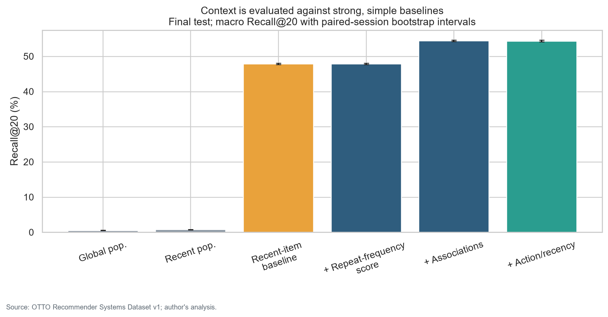
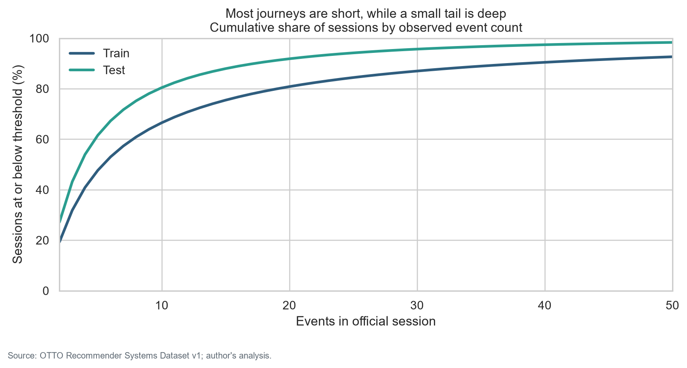
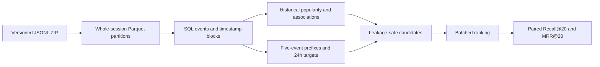
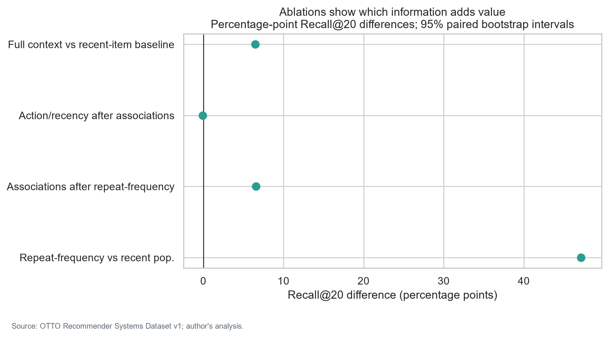
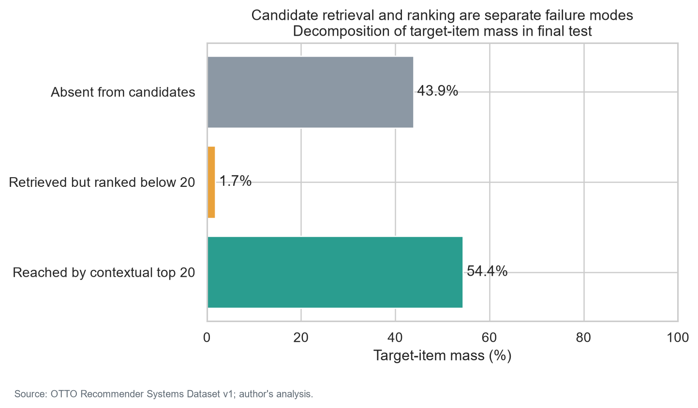
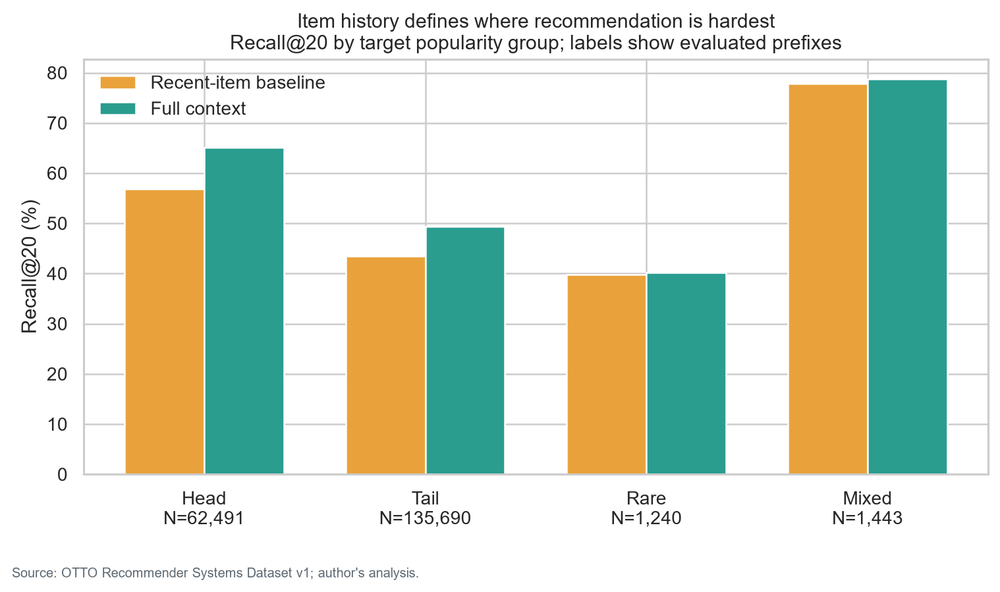

# Beyond Popularity: Consumer Journeys and Contextual Recommendations

**A SQL-first behavioral data science case study asking whether recent session context improves next cart/order recommendation over popularity and a recent-item baseline.**

## Executive finding

On 200,864 held-out positive test prefixes, full context improved Recall@20 versus the recent-item baseline by **+6.48 pp (95% CI +6.37 to +6.59)** and differed from recent popularity by **+53.60 pp (95% CI +53.38 to +53.80)**. Candidate retrieval covered 56.12% of target-item mass. The result quantifies offline agreement under a fixed protocol; it does not estimate recommendation-caused conversion or revenue.

| Strategy | Recall@20 | MRR@20 |
|---|---:|---:|
| Global popularity | 0.53% [0.50%, 0.56%] | 0.15% [0.14%, 0.16%] |
| Recent popularity | 0.77% [0.73%, 0.81%] | 0.38% [0.35%, 0.40%] |
| Recent-item baseline | 47.90% [47.68%, 48.11%] | 40.56% [40.36%, 40.76%] |
| + Repeat-frequency score | 47.90% [47.68%, 48.11%] | 32.69% [32.52%, 32.86%] |
| + Associations | 54.46% [54.24%, 54.66%] | 33.60% [33.42%, 33.76%] |
| + Action/recency context | 54.38% [54.16%, 54.58%] | 35.63% [35.45%, 35.80%] |

## Why this question matters

Popularity is cheap, robust and often underestimated. Repeating recently viewed items is a strong behavioral baseline. More context is useful only if item transitions, action type and recency add material held-out value at an acceptable complexity cost. This project separates candidate retrieval from ranking so a missed target is diagnosed at the correct system layer.

## Data and consumer journeys

OTTO v1 contains 230,567,389 anonymous click, cart and order events across 14,571,582 official sessions over five weeks. Every event was processed; no row or session sampling. A session is one user's activity inside a source period, not a 30-minute visit. Prices, categories, demographics, inventory and recommendation exposure are unavailable and never invented.

Journey analysis keeps simultaneous events as blocks, distinguishes repeats from breadth, and summarizes observable action-block transitions. It avoids psychological labels: a cart event is closer to purchase operationally, but is not a direct measure of intention.

## Frozen temporal design

One recommendation is made after the first five observed interactions, including every event tied at the cutoff timestamp. The target is the distinct item set at the first later cart/order timestamp within 24 hours. Weeks 1–3 build validation history; week 4 is validation; all four training weeks build final history; the official following week is untouched final test. History is strictly earlier than each period.

Candidates unite prefix items, 30 historical next-cart/order neighbors per prefix item, and 200 global plus 200 recent popular items. No target is injected. The fixed ablation adds session repetition, directional item associations, then transparent action/recency weights. There is no learned ranker, neural model or metric-driven retuning in V1.

The seven auditable SQL files implement normalization, session and block aggregates, temporal history, prefix/target construction, associations, candidates and evaluation. High-risk joins have cardinality assertions; future-target mutation tests verify prefix invariance.

## What information adds value?

The full contextual strategy's Recall@20 is 54.38%; its MRR@20 is 35.63%. Associations added +6.56 pp (95% CI +6.45 to +6.67); action/recency added -0.08 pp (95% CI -0.11 to -0.06). The interpretation follows the observed size and uncertainty rather than declaring every nonzero change practically important.

## Where the system fails

The subgroup report includes head, tail, rare and mixed target sets; exactly-five versus cutoff-tie-extended prefixes; repeat-heavy versus broader exploration; and prior-cart/order versus click-only histories. Groups below 100 prefixes are not interpreted. Performance differences describe the logged test cohort and are not evidence of algorithm-caused discrimination.

## Business interpretation

- Use recent popularity as a dependable cold/fallback layer and the recent-item baseline as the operational complexity benchmark.
- Add context only where the paired improvement, candidate coverage and latency justify it; the frozen ablation identifies the contributing signal.
- If retrieval loss dominates, improve candidate sources before tuning ranking. If ranking loss dominates, better candidate scoring is the more direct next step.
- Run a controlled online experiment with real exposure, inventory and guardrail logs before any claim about conversion, revenue, satisfaction or welfare.

## Limitations and ethics

This is historical, anonymous platform behavior without product or exposure context. The final test is one week; the ranking estimand conditions on an observed future action; duplicate events and source capping may affect journeys; fixed heuristic weights are not probabilities. Popularity can reinforce concentration and rare items are intrinsically difficult. See [Ethics and limitations](ETHICS_AND_LIMITATIONS.md).

## Reproduce

Python 3.13, DuckDB 1.5.5, PyArrow 23.0.1, pandas/NumPy and SQL. Raw and event-level files are ignored. A clean clone can run acquisition through reports using the commands in [data/README.md](data/README.md). CI uses synthetic data only and tests parsing, type mapping, ordering, tie-safe prefixes, horizon targets, temporal boundaries, leakage, candidates, metric math, deterministic ranks, join cardinality and reproducibility.

## Navigate

| Start here | Purpose |
|---|---|
| [Project design](PROJECT_DESIGN.md) | Frozen estimand, splits, candidates, metrics and limitations |
| [Data sources](DATA_SOURCES.md) / [license](DATA_LICENSE.md) | Version, hashes, attribution and transformation disclosure |
| [Data quality](DATA_QUALITY.md) | Full audit and transparent sample flow |
| [`sql/`](sql/) / [`src/`](src/) | Auditable analytical transformations and orchestration |
| [`notebooks/`](notebooks/) | Executed audit, journeys, baselines, evaluation and errors |
| [Technical report](reports/TECHNICAL_REPORT.md) | Complete metric and uncertainty interpretation |

**Boundary:** this is an interpretable OTTO V1 case study. A possible LightGBM ranker is documented only as future work; it is not implemented.
